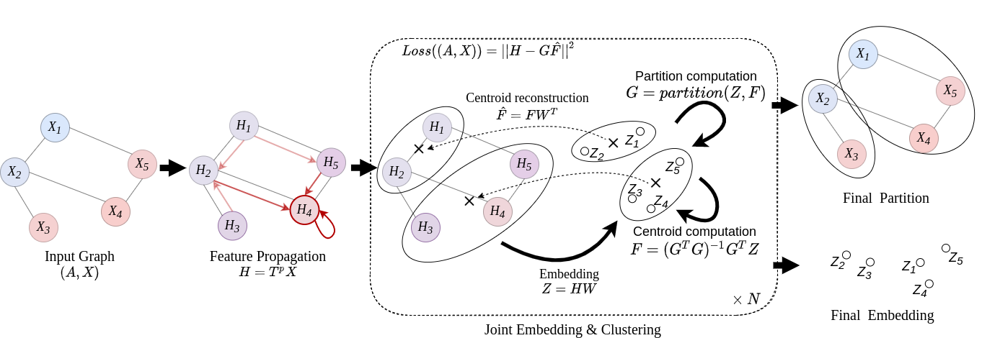

# Graph Convolutional Clustering

This repository provides Python (Tensorflow) code to reproduce experiments from the WSDM '22 article *Efficient Graph Convolutional Representation Learning for Graph Clustering*.




## Installation

```bash
python setup.py install
```

## Run Experiments
#### Parameter list
For `run.py`

| Parameter        | Type           | Default | Description  |
| :-------------: |:-------------:| :----:|:-------------------------------- |
| `dataset` | string| `cora`| Name of the graph dataset (`cora`, `citeseer`, `pubmed` or `wiki`). |
| `power` | integer| `5`| First power to test. |
| `runs` | integer| `20`| Number of runs per power. |
| `n_clusters` | integer| `0`| Number of clusters (`0` for ground truth). |
| `max_iter` | integer| `30`| Number of iterations of the algorithm. |
| `tol` | float| `10e-7`| Tolerance threshold of convergence. |

For `tune_power.py` parameters are the same except for `power` which is replaced by

| Parameter        | Type           | Default | Description  |
| :-------------: |:-------------:| :----:|:-------------------------------- |
| `min_power` | integer| `1`| Smallest propagation order to test. |
| `max_power` | integer| `150`| Largest propagation order to test. |


#### Optimal Orders


| Dataset        | Propagation order           |
| :-------------: |:-------------:|
| `citeseer` | `12`|
| `cora` | `5`|
| `pubmed` | `150`|
| `wiki` | `4`|

#### Example
To adaptively tune the power on Cora use
```bash
python gcc/tune_power.py --dataset=cora
```

To run the model on Cora for power `p=12` and have the average execution time
```bash
python gcc/run.py --dataset=cora
```
